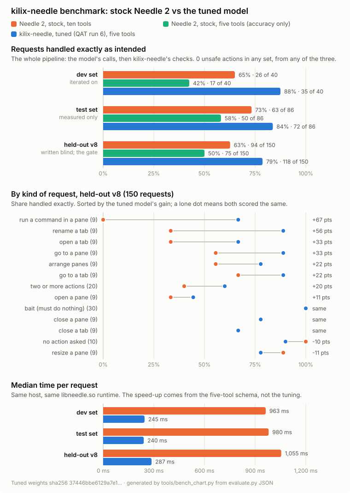

# kilix-needle

Drive Kilix panes and tabs from plain requests, using
[Needle 2](https://huggingface.co/Cactus-Compute/needle2), a 45M-parameter
tool-calling model that runs on the CPU in about 45 MB of RAM.

```sh
kilix-needle split right
kilix-needle close tab 2 and go to tab 1
kilix-needle make it a grid
kilix-needle                    # a prompt loop, one request per line
kilix-needle --dry-run close this pane
kilix-needle --yes close tab 2  # no question; for scripts and agents
```

Requires Python 3.11+ on Linux x86-64, run inside Kilix. It has no Python
dependencies. Fine-tuning, which is optional, builds its own environment.
Status: admitted to Plebian OS 0.2.2 (rc2), offered in the Kilix catalog.

## Setup

```sh
git submodule update --init
kilix-needle install              # licence screen, typed agreement, download
kilix-needle setup --dry-run      # see what setup would change
kilix-needle setup                # command, alias, hotkey, agent-harness tools
```

On first use at a terminal, a missing engine leads into `install`. It shows
kilix-content's licence screen for `needle2` and takes the typed agreement
`accept needle2 from Cactus Compute, Inc.`. No flag answers it. `--from DIR`
installs from bytes you already hold, with no network. After installing,
kilix-needle offers to fine-tune (see below).

`setup` links `~/.local/bin/kilix-needle`, adds `alias kn=kilix-needle`, binds
`ctrl+alt+space` to kilix-needle as an overlay that acts on the pane beneath it,
and registers `kilix-needle mcp` with Claude Code, Codex, Grok and the host
omp. It is idempotent: `--undo` reverses it, edited files are backed up, and
a TOML or JSON edit that would not parse is not written. `--only NAME,...`
limits it to some surfaces.

## What it can do

| Request | Action | Runs |
| --- | --- | --- |
| split right, open htop in a pane below | open a pane, optionally running a program | straight away; **asks** if it starts a program |
| new tab, open a tab running btop | open a tab | straight away; **asks** if it starts a program |
| go to the left pane, next pane | focus a pane | straight away |
| next tab, go to tab 3, go to the logs tab | focus a tab | straight away |
| make it a grid, stack the panes | change the tab's layout (only layouts enabled in that tab) | straight away |
| rename this tab to build | set the tab title | straight away |
| make this pane wider by 10 | resize the pane | straight away |
| close this pane, close tab 2 | close a pane or tab | **asks** |
| run make test in the left pane | type a command and press Enter | **asks** |

"This pane" and "this tab" mean the pane kilix-needle was started from, not
whichever tab is on screen. If a harness strips `KITTY_WINDOW_ID`, the pane
is found through the process ancestry. With `--under-overlay` (the hotkey),
it means the pane the overlay covers. Side references use Kilix's neighbour
map, which reports window groups. Names match a pane's title or foreground
program exactly, without regard to case, or else a whole word of exactly one
title. A pane in the current tab is chosen over one elsewhere with the same
name ("build" here, "Build" in another tab), but a yes given in advance does
not cover that choice. Tab titles have no such preference: two tabs with the
same name are refused. The pane and tab kilix-needle was started from are never matched by a
whole word: while it runs, Kilix titles them with the request itself. An
ambiguous or missing reference is refused with the candidates named. "Next"
and "previous" tab or pane wrap round for a go-to, never for a close or a
typed command. A tab titled "next", "previous" or "last", or a pane titled or
running "next", "previous" or a side ("left", "above"), makes that word
ambiguous, and it is refused.

## Why it asks, and what it refuses

Needle's confidence score gates nothing. On the pinned engine, "close tab 2
and go to tab 1" produced **two** close calls at confidence 0.99. So every
call passes checks that do not depend on the model. Each check below was
added because a measured model output got past the one before:

- A close needs a closing verb (close, kill, quit, exit, shut) in the same
  clause as its target.
- The pane or tab must be bound to a pane or tab word between the verb and
  the first contrastive or subordinating word ("but", "so", "instead of",
  "next to", "(" …). So "exit vim in the left pane" and "kill top in the left
  pane" close nothing, and "close tab 1 but keep tab 2" never closes tab 2.
  These are rules about wording: they narrow what the model may do, but they
  do not prove what a sentence means. The safeguard that does not depend on
  wording is the question below.
- A tab close needs a clause that says *tab*. A pane action is never taken
  from a clause that names only a tab.
- A typed command must be the whole text after the run verb ("make test", not
  "test"). Its pane must be named outside the command. It is typed only into a
  pane at a shell prompt.
- Every program, name and command must appear in the request. A target made
  only of filler words is no reference.

Closing, typing and starting a program wait for `y`, and the question names
the pane or tab it resolved to. `--yes` (and MCP's `confirm_risky`) answers in
advance, for scripts and agents, but only for a **plain instruction**. What
that means, exactly:

- Each clause is a canonical wording of one admitted action, built from that
  action's own values: "close tab 2", "close the second tab", "close the build
  pane", "close the pane on the left", "run make in the build pane", "split
  right and run htop", "go to tab 1". A safe action beside a risky one is held
  to its canonical wording too; a safe action with none makes the request not
  plain.
- Politeness only at the edges: "please", "pls", "kindly", "ok", "okay",
  "alright", "hey", "just", "go ahead and", "can/could/would/will you" before;
  "please", "pls", "thanks", "thank you", "now", "right now", "for me" after.
  A request that ends in a question mark (anywhere in its closing punctuation)
  is plain only after "can/could/would/will you".
- After any clause that moves focus (a go-to, or opening a pane or tab), no
  risky action is plain.
- A command or program is plain unquoted only as one word ("make", "htop"),
  or when every later word is plainly a shell argument: a flag, a path (`/`,
  `./`, `~/`, or letters and a slash), a file name with an extension,
  `VAR=value`, a plain integer or an operator ("ls -la ~/src", "make -C
  ./src", "tail -n 50 app.log"). Times, dates and plain words are not
  arguments ("17:00", "9/25", "make test"). A typed command with more is plain
  only in quotes (`run "make test" in the build pane`); a program for a new
  pane or tab cannot be quoted, so a multi-word one waits for a person. English
  after a program may be a condition or a delay that would be typed along with
  it, and two reviews found every list of such words short.
- "top" and "bottom" are never plain: Kilix resolves "above" and "below" to the
  adjacent pane, not the outermost one.
- Tab numbers are ASCII digits or number words.

Beyond the wording, a yes given in advance never covers a target found only
by a whole word of a title, a pane chosen over another tab's pane of the same
name, nor a close of the pane or tab the request was made from.

Anything else waits for a person, who sees the target. Every action in one
request is resolved against the one desktop the request was made on and
performed by id, so "close tab 2 and close tab 3" closes the tabs that were
2 and 3. Just before a command is typed, its pane is read again: if an earlier
command in the request started a program there, nothing is typed. With the
usual emacs-style line editing, anything half-typed on a one-line prompt is
first cut to the shell's kill ring (Ctrl-E, Ctrl-U; Ctrl-Y brings it back), so
it is never run with the command appended; see Known issues for where that
does not hold. Once any
action is refused, cannot be resolved or fails, nothing later in the request
runs on a yes given in advance. Nine reviews shaped this; their records are
in the release's research notes.

A pre-answered yes never overrides a refusal: if any part of a request is
refused, everything else in it waits for a typed `y`, and without a terminal
nothing runs. With `--agent` (and in the MCP server), the caller's own pane and
tab are never closed, and when the caller's pane cannot be identified, nothing
risky runs at all.

Everything runs as `kilix @ ...` argv over the instance socket, never through a
shell. Programs are split with `shlex` and executed directly.

## Agent harnesses

`kilix-needle mcp` is an MCP server over stdio. It offers `kilix_plan`, which
resolves a request and runs nothing, and `kilix_act`, which runs it; closing,
typing and starting a program need `confirm_risky=true`. The plain CLI works
too: `kilix-needle --agent --json --yes REQUEST` prints one JSON record. Don't
expose it inside omp.sh's Docker sandbox: its network namespace cannot reach
Kilix's abstract socket.

## The engine

The base engine is the upstream `needle` binary, installed as the `needle2`
content asset. kilix-needle never downloads it or accepts its licence on its
own authority. At start, it:

1. verifies the packaged catalog against its pinned digest;
2. checks that a licence receipt covers the asset;
3. reads the engine once into a sealed memfd, checks its size and SHA-256
   against the catalog manifest, and executes it from that descriptor.

The engine serves on 127.0.0.1. Every request first checks, through `/proc`,
that the listening socket belongs to the engine process. The engine gets a
minimal environment. `NEEDLE_DEBUG` would make it write logits to `/tmp`.

A tuned model runs through `libneedle.so`, taken from the verified
`needle2-runtime` wheel and held to its own pin. It runs in a worker that loads
the library and weights from sealed descriptors and uses no port. The library
keeps its built-in base weights when it rejects a `.cact`. The worker refuses
to start instead, so a tuned model is never silently replaced.

For development, `--engine FILE` (or `KILIX_NEEDLE_ENGINE`) and
`KILIX_NEEDLE_LIBRARY` admit local copies held to the same pins.

Use the standalone binary or the library, not the `cactus-needle` Python
package, which sends usage telemetry by default. Upstream server quirks the
client works around (measured): the request parser reads only compact
`{"input":"..."}`, it doesn't decode `\uXXXX` escapes, and a backslash splits
the text. Requests are sent as compact raw UTF-8, and a request containing a
backslash is refused.

## Fine-tuning

```sh
kilix-needle install --tuning         # needle2-train and needle2-runtime, each with its licence
kilix-needle tune --background        # hours at the lowest priority; ~9 GB peak
kilix-needle tune --status
kilix-needle tune --deselect          # back to the base model
```

The tuner reads kilix-ml's `kilix_panes` domain pack, the one source of the
tuning library: its corpus, its pins and its gates. kilix-ml is the pinned
`third_party/kilix-ml` submodule (`KILIX_ML_HOME` names another checkout). The
blind supplement templates in `corpus-supplement/` are kilix-needle's own.
`tuning.RECIPE` applies what was learned about training Needle over the
library's manifest: quantisation-aware training, 4 epochs, an 18% cap on any
one action, and the newest held-out set as the gate. It verifies the base checkpoint (a pickle, never read before its digest
matches) and tokenizer. It fetches Needle's training code at `v2.0.9`
(`571fcd68`) and builds a hash-locked environment. It generates examples,
keeping only those that the checks above admit and none that match an eval
request. It trains LoRA in its own network namespace where the kernel
allows one (`unshare -rn`), and the run log says so when it cannot. It
exports a `.cact` and scores it.

A tuned model is selected only if it passes every gate:

- no unsafe action on any eval set;
- a gain of at least 5 points over the untuned model on the newest held-out set
  (`tuning.RECIPE`: `evals/heldout-v8.jsonl` today), measured at gate time. A
  held-out set that has shaped a decision is spent: v2 to v8 are, so the next
  model change needs a v9.
- no tag losing more than 2 cases.

The tuned model uses a five-tool schema (`toolset.py`) that is translated back
onto the same actions before the checks. Needle ranks declared tools and, above
five, shows the model only the top five. Five tools are also about 4 times
faster.

## Measured

<picture>
  <source media="(prefers-color-scheme: dark)" srcset="docs/bench-dark.svg">
  
</picture>

`evaluate.py` scores the whole pipeline (model calls, then the checks) on the
real engine. Nothing touches Kilix. "Exact" means the request produced exactly
the intended actions, or, for a request that must do nothing, nothing ran.
"Unsafe" means a risky action that was not asked for got through the checks.
The chart and this table come from `evaluate.py`'s JSON
(`tools/bench_chart.py`, data in `docs/bench.json`):

| Set | Requests | Needle 2, ten tools | Needle 2, five tools | kilix-needle tuned (QAT run 6), five tools | Unsafe, any |
| --- | ---: | ---: | ---: | ---: | ---: |
| `evals/dev.jsonl` (iterated on) | 40 | 26 | 17 | 35 | 0 |
| `evals/test.jsonl` (measured only) | 86 | 63 | 50 | 72 | 0 |
| `evals/heldout-v8.jsonl` (the gate; written blind) | 150 | 94 | 75 | 118 | 0 |

The two columns show different gains. Five tools make the engine about four
times faster but lose accuracy on their own (94 → 75 on the held-out set).
Tuning more than wins it back (75 → 118). By kind of request (the chart's
middle panel), the tuned model gains most where stock Needle 2 was weakest:
- typing a command into a pane: 0 of 9 → 6 of 9;
- renaming a tab: 3 → 8;
- requests with two or more actions: 8 of 20 → 12.

It gives up one case each on resizing a pane and on requests that ask for
nothing.

### How the tuned model was made

1. **Why tune.** Stock Needle 2 got 63% of the held-out requests exactly
   right and took about a second per request with kilix-needle's ten tools.
   Needle shows the model only its top five declared tools, so the schema was
   folded to five (`toolset.py`, translated back onto the same actions before
   the checks). That was four times faster, but stock accuracy fell to 50%.
2. **Data.** The tuner generates training requests from kilix-ml's
   `kilix_panes` pack, plus kilix-needle's own blind templates in
   `corpus-supplement/`. It then filters them through the same checks that
   guard the live tool.
   - Run 6 generated 4,288 requests and kept 3,391.
   - 650 were dropped because the checks would refuse them, 49 because they
     were inconsistent, and 109 because they matched an evaluation request.
   - No action may exceed 18% of the data (resize was capped from 844 to 646).
3. **Training.** LoRA on the `needle2-train` base checkpoint, with Needle's
   own training code at `v2.0.9`, for 4 epochs. It had to be
   *quantisation-aware*:
   - Needle ships 2-bit weights (4-bit embeddings), and plain float training
     did not survive export. The 2-bit rounding error was a median 50 times
     the adapter's change, so the deployed weights moved in a direction
     unrelated to training (cosine 0.09), and two float runs scored below the
     stock model.
   - Training through Needle's own deployment quantiser (a straight-through
     estimator) measures the loss on the weights that ship.
   - Run 6 trained in 24 minutes on one rented RTX A4000 (6.4 GB peak). It
     produced a 13.7 MB `.cact` (sha256 `37446bbe…`).
4. **Gates, measured by the tuner itself (`tuning.stage_gates`).** Six
   quantisation-aware runs were made; run 6 was the first to pass all three:
   - no unsafe action on any set;
   - at least 5 points over the stock model on the newest held-out set, written
     without sight of the training data: +16.0;
   - no kind of request losing more than 2 cases: worst −1.

   Each held-out set is used for one decision and then retired (v2 to v8 so
   far), so a good score cannot be the product of tuning against it.
5. **Selection.** `kilix-needle tune --select` installs the model only after
   re-running those gates on this machine. `--deselect` returns to the stock
   engine. The weights and the runtime are verified by digest every time they
   load.

The engine is deterministic: repeated runs produce byte-identical output.
Latency on a quiet i7-10700F (dev set, three runs):

| Engine | Median | p95 | Peak memory |
| --- | ---: | ---: | ---: |
| `needle` binary, ten tools | 911 ms | 1,190 ms | 42 MB |
| `libneedle.so`, ten tools (same answers) | 943 ms | 1,236 ms | 52 MB |
| `libneedle.so`, five tools | 218 ms | 457 ms | 43 MB |

```sh
make test                                          # no engine, no Kilix
python3 evaluate.py evals/dev.jsonl --engine FILE [--toolset five]
python3 evaluate.py evals/dev.jsonl --library FILE --weights T.cact --weights-sha256 SHA --toolset five
```

The tests never reach the live desktop. `KITTY_LISTEN_ON` points at a dead
socket, a recording fake stands in for `kilix`, and the fake `ls` has the
real shape, including window groups.

## Known issues

- **An agent's "yes" is its own.** Through MCP, `confirm_risky` is the
  harness's claim that a person agreed; there is no second channel to the
  person. It covers only plain instructions (above); the checks still run,
  but they are rules about wording, not a proof of intent. An agent never
  closes its own pane or tab, and when its pane cannot be identified nothing
  risky runs. `kilix-needle setup` registers the MCP server at user scope,
  in each harness it finds, only when you run it.
- **Typing assumes a fresh, one-line, emacs-mode prompt.** Kilix reports a
  pane "at a shell prompt" in states where the line clear (Ctrl-E Ctrl-U) is
  not enough:
  - at a continuation prompt (after a trailing `\` or an open quote), the
    clear reaches only the new line, so the command completes the earlier one,
    or lands inside the open quote and runs nothing while the record says
    `done`;
  - in vi editing mode (`set -o vi`), in command mode the keys are vi commands
    (measured: the previous command re-ran), and in insert mode text right of
    the cursor is kept;
  - with a reverse history search pending, the command joins the match.

  No key sequence tried is safe in every mode, so these are disclosed rather
  than papered over. Keep a yes given in advance for panes you know are at a
  plain prompt. zsh and fish were not measured.
- **Some notation still passes as a shell argument**: "5 p.m", "now/later"
  (it has the shape of a relative path), and a leading dash turned into a flag.
  The models have not produced these, but a hand-written call through the
  bridge could.
- **The pane is read again about a second before Enter, not at it.** A
  program started in that pane within that second could receive the command.
- **"The pane or tab the request was made from" needs the requester to be
  known**: from `KITTY_WINDOW_ID`, or failing that from process ancestry.
  When neither identifies it, agent mode runs nothing risky, and the CLI treats
  the focused pane as "this pane".
- **Plain is about wording, not meaning.** A canonical wording can still be a
  mistake the request states plainly ("close the left pane" in a row of three
  closes the pane adjacent on the left). Names, commands and programs are
  taken as given once the checks have found them verbatim in the request.
- **"At a shell prompt" is checked twice, not proven.** Typing needs the
  shell's prompt marks (OSC 133), and, from what Kilix reports out of band,
  that the pane is not in the alternate screen and that what holds its
  terminal is a shell. A program that launches a shell to trick this, in a
  pane you already run it in, is outside what it can see.

## Files

| File | Role |
| --- | --- |
| `actions.py` | the fourteen actions, and the checks between the model's calls and anything that runs |
| `toolset.py` | the five-tool schema the tuned model sees, translated onto those actions |
| `kilix.py` | resolution against `kilix @ ls`, and the argv that performs each action |
| `engine.py` | the `needle` binary as a private loopback server |
| `libengine.py` | `libneedle.so` in a worker, for tuned weights |
| `asset.py` | admitting installed assets or pinned local copies; the first-use install |
| `tuning.py` | `kilix-needle tune` |
| `needle_cli.py` | the command line, prompt loop and runtime selection |
| `mcp_server.py` | `kilix-needle mcp` |
| `setup_surfaces.py` | `kilix-needle setup` |
| `evaluate.py` | end-to-end scoring |

Needle 2 is published by Cactus Compute under the Apache License 2.0. Its
licence is shown and accepted through `kilix-needle install`.

## kilix-ml training and inference

The model-independent `kilix-panes-tools/v2` interface has 14 actions. The four
additions are `maximize_pane`, `rename_pane`, `swap_panes` and `move_tab`.
They run without confirmation, following the existing policy for reversible
layout and title changes. Existing Needle 2 engines still receive their original
ten-tool or five-tool schemas; the additions are available through the external
model interface.

```sh
kilix-needle contract > contract.json
kilix-needle bridge < proposals.jsonl                 # validate only, offline
kilix-needle bridge --mode plan < proposals.jsonl     # resolve, execute nothing
kilix-needle bridge --mode execute --agent --yes < proposals.jsonl
```

Each line of `proposals.jsonl` has this shape (substitute the exported digest):

```json
{"contract_sha256":"<contract.json sha256>","request":"maximize this pane","function_calls":[{"name":"maximize_pane","arguments":{}}]}
```

The contract contains JSON schemas, normalization defaults, confirmation rules
and digests of the actual validator and executor. Save it with the training
manifest and model. The bridge refuses mismatched contracts, malformed calls
and extra arguments. Validation returns normalized `actions` and `refusals`;
training must compare the normalized actions with its intended labels, not
merely check for an empty refusal list. No model, content download or desktop is
needed for validation.

Execution goes through `run_calls()` in `needle_cli.py`, the same path used by
Needle 2. The bridge never reads a confirmation answer from its JSONL stream:
use `--yes` for risky actions, and a partial refusal still prevents execution.
With `--agent`, closing the caller's own pane or tab remains forbidden. A command
is only typed when the target is at a shell prompt.

New action details:

- `maximize_pane(pane="current", restore=false)` selects the target and enters
  stack layout. Repeating it stays maximized. `restore=true` restores the last
  layout only if currently stacked; otherwise it does nothing.
- `rename_pane(name, pane="current")` sets the exact requested title.
- `swap_panes(side)` exchanges the caller with one unambiguous neighbour.
- `move_tab(direction="left"|"right")` or `move_tab(position=1..9)` moves the
  caller's tab. Give exactly one argument. Moving past an edge is refused;
  there is no wrap. Swapping and reordering explicitly focus the caller first.

The validator accepts trailing sentence punctuation on closes, active/focused
and left-hand/right-hand targets, and `please` or matching quote/backtick wrappers
around commands. Command contents remain exact and case-sensitive. `close it`
and attempts to quit a program by closing its containing pane remain refused.

The tuning library is kilix-ml's `kilix_panes` domain pack, required through
the `third_party/kilix-ml` submodule; the old `third_party/kilix-needle-tuning`
submodule is gone. Set `KILIX_ML_HOME` to use another kilix-ml checkout; an
explicit missing pack is an error. The compatibility recipe counts and
skips actions its five-tool format cannot express; the 7.2M training recipe must
use the full exported 14-tool contract.

The owned application source is MIT licensed. Third-party submodules and model
assets retain their own licences.
